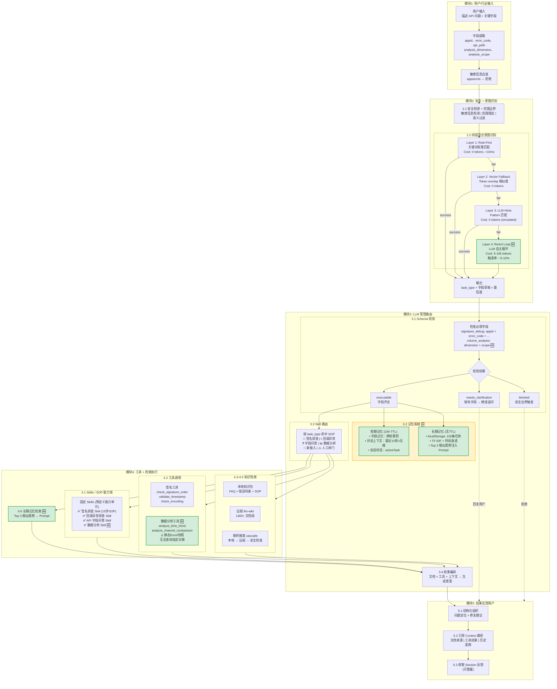
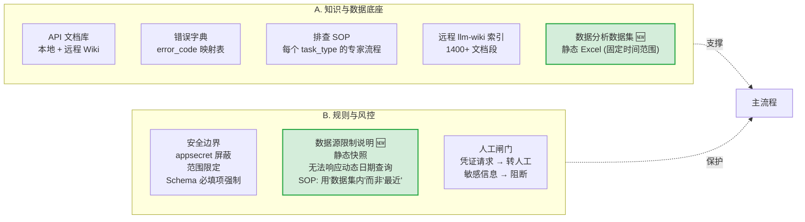
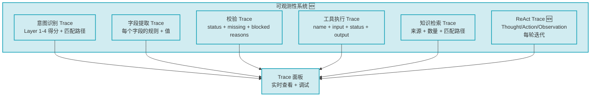

# API 智能客服 Agent 交互架构图 V2

基于当前 demo 实际能力的完整架构图（含记忆系统、ReAct Layer 4、可观测性）

---

## 主流程架构图

---

## 支撑系统

---

## 可观测性系统（贯穿所有模块）

---

## 三大核心价值（架构图底部说明框）

### 💡 记忆系统：为什么不让 LLM 重问

**核心价值**：
- 自动继承已知字段（appid 提供一次，后续自动带入）
- 代码编排式记忆 vs Prompt 拼接：字段继承不消耗 token，更确定
- 长期记忆注入相似案例：让 LLM 学习历史解决方案

**实现原理**：
- 代码硬记忆 X、Y、Z（appid、error_code、...）并自动合并
- 历史对话存 localStorage（X, Y 已知），比 LLM 模糊上下文可靠
- 长期记忆 TF-IDF 检索 + 时间衰减，注入 Top 3 作为 few-shot

---

### ⚖️ Schema 校验：为什么不让 LLM 直接猜

**核心价值**：
- 用代码验证 vs LLM 猜测：工具需要字段时，代码判断（逻辑 + schema），LLM 判断容易出错
- 规则驱动 vs LLM 判断：代码逻辑比 LLM 更"可靠"，比 LLM 判断更便宜（0 token）
- Schema 必填项强制：防止 LLM 凭不完整信息硬答，提高回答质量

**实现原理**：
- 代码检查必填 X、Y（appid、error_code、timestamp 等）并对比 rule
- 缺失 → 追问，齐全 → 工具调用
- 15 步签名 SOP（参数顺序 → timestamp → 签名方法...）比让 LLM 先猜再验 prompt 更短

---

### 📚 Skill SOP: 为什么不让 LLM 现场发挥

**核心价值**：
- 把专家经验固化为 SOP 文档，保证回答质量一致
- SOP 文档 vs 零样本决策：固定的排查流程，不依赖 LLM 临场发挥
- 知识更新只需改 SOP，不用重新训练或调整 prompt

**实现原理**：
- 15 步签名排查 SOP（参数排序 → timestamp → 签名方法...）
- 注入 System Prompt，LLM 遵循 SOP 执行
- 数据分析 SOP：明确数据源限制，指导 LLM 正确表述时间范围

---

## 图例说明

🆕 = V2 新增功能
🔐 = 签名排查
📞 = 回调异常
❓ = 字段问答
📊 = 数据分析
🚀 = 新接入
⚠️ = 人工闸门 / 数据限制

**颜色标注**：
- 🟢 绿色：新增功能（记忆系统、ReAct、数据分析增强）
- 🟡 黄色：记忆系统相关
- 🔵 蓝色：可观测性系统
